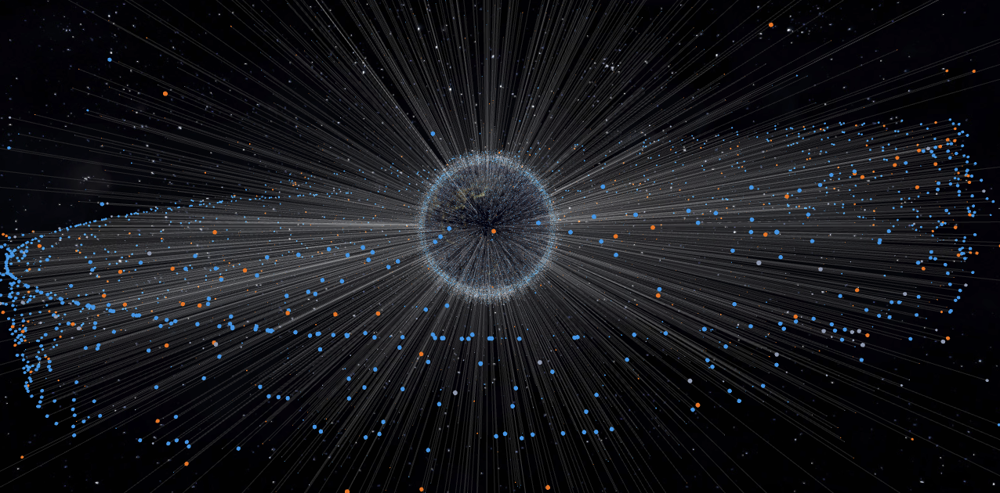

<p align="center">
  
</p>

<h1 align="center">Satplex</h1>

<p align="center">
  A high-performance, real-time 3D satellite tracking and orbital visualization platform built with React, TypeScript, and Three.js.
</p>

<p align="center">
  <strong><a href="https://satplex.io">satplex.io</a></strong>
</p>

<p align="center">
  <a href="#key-features">Key Features</a> •
  <a href="#getting-started">Getting Started</a> •
  <a href="#tech-stack">Tech Stack</a> •
  <a href="#data--attribution">Data & Attribution</a>
</p>

---



## Overview

**Satplex** is a modern aerospace tracking dashboard that computes and visualizes satellite coordinates in real time. Using high-precision SGP4 orbital propagation calculated entirely client-side, Satplex maps thousands of active and inactive orbital objects onto an interactive 3D globe. 

Designed with a premium dark-mode aesthetic and fully responsive user interface, it provides comprehensive space situational awareness for aerospace enthusiasts, researchers, and developers. Satellite data is refreshed daily via an automated pipeline.

---

## Key Features

- **Real-Time 3D Visualization**: Render orbits and satellite locations interactively on a high-fidelity Earth globe with atmospheric scattering, night-lights, and stars.
- **Client-Side SGP4 Propagation**: Compute instantaneous positions, velocities, and altitudes of satellites in real-time using standardized Two-Line Element (TLE) datasets.
- **Comprehensive Orbital Metadata**: Inspect operational status, launch details, orbital classification (LEO, MEO, GEO), and operators for tracked objects.
- **High-Performance Rendering**: Leveraging React-Globe.gl and Three.js to seamlessly render thousands of points and orbits at 60 FPS.
- **Responsive Layout**: Designed for mobile and desktop screens alike, featuring a smooth panel and sheet drawer navigation system.

---

## Tech Stack

- **Framework**: [React](https://react.dev/) + [TypeScript](https://www.typescriptlang.org/)
- **Build Tool**: [Vite](https://vite.dev/)
- **Styling**: [Tailwind CSS](https://tailwindcss.com/)
- **3D Graphics**: [Three.js](https://threejs.org/) / [React-Globe.gl](https://github.com/vasturiano/react-globe.gl)
- **Orbital Mechanics**: [SGP4.js / Satellite.js](https://github.com/shashwatak/satellite-js)

---

## Getting Started

### Prerequisites

- [Node.js](https://nodejs.org/) (Version 18 or higher recommended)
- `npm` (comes bundled with Node.js)

### Installation

1. **Clone the Repository**
   ```bash
   git clone https://github.com/mwatiker/satplex.git
   cd satplex
   ```

2. **Install Dependencies**
   ```bash
   npm install
   ```

3. **Start the Development Server**
   ```bash
   npm run dev
   ```

4. **Build for Production**
   ```bash
   npm run build
   ```
   The static distribution files will be created in the `dist/` directory, ready to be deployed to Netlify, Vercel, or GitHub Pages.

---

## Data & Attribution

Satellite data is primarily sourced from [Space-Track.org](https://www.space-track.org).

Additional metadata is integrated from the following aerospace databases:
- [CelesTrak](https://celestrak.org/)
- [SatNOGS](https://satnogs.org/)
- [Gunter's Space Page](https://space.skyrocket.de/)
- [GCAT](https://planet4589.org/space/gcat)
- [Union of Concerned Scientists](https://www.ucsusa.org/resources/satellite-database)
